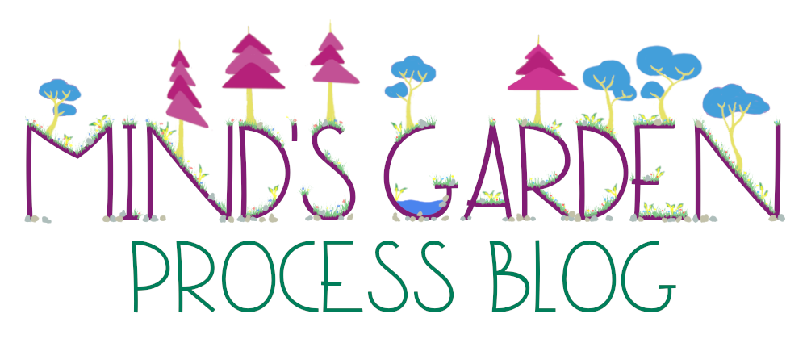
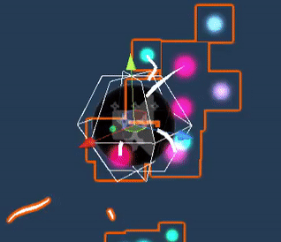
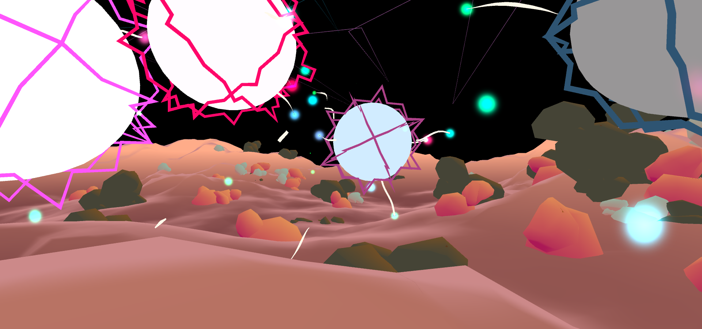
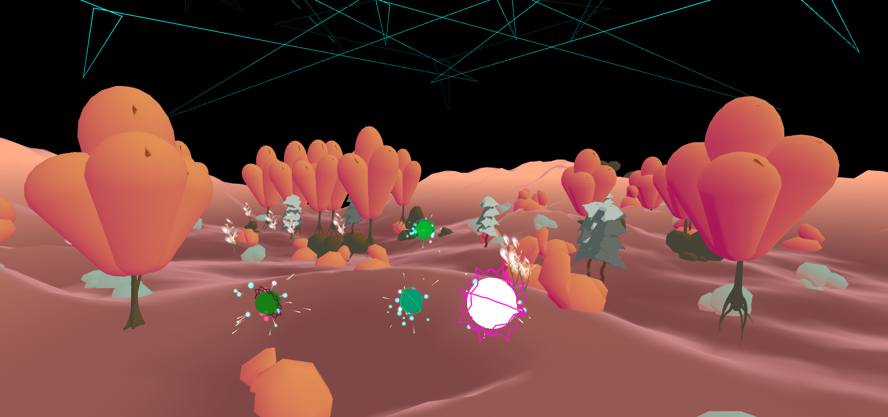
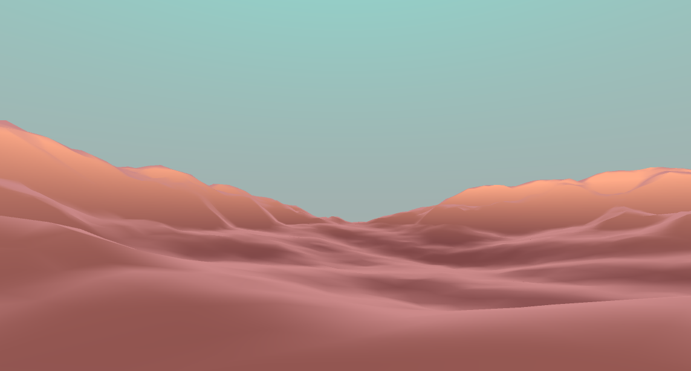
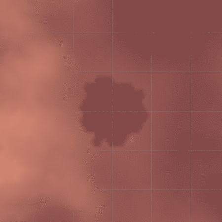
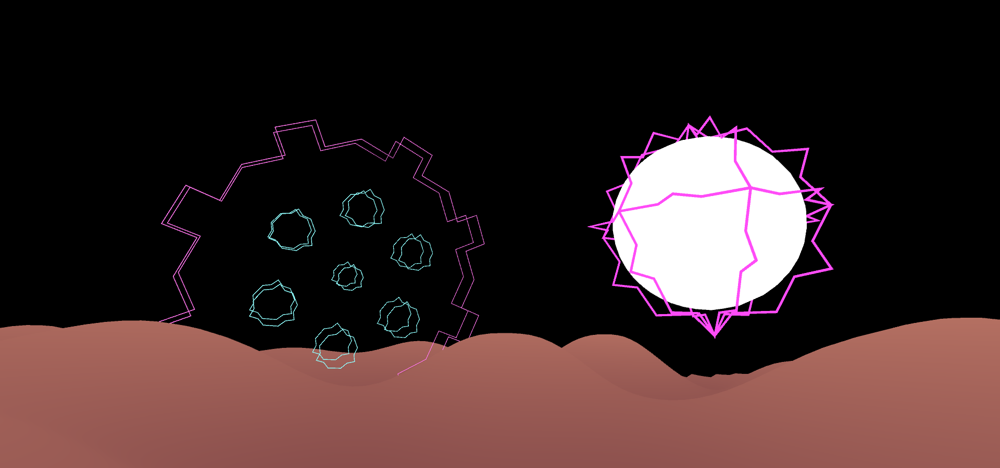
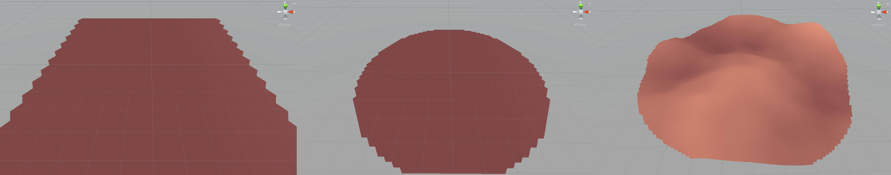

Mind's Garden is a first person musical exploration game which reads in audio files to procedurally generate various terrains, characters, and experiences for the player to explore and discover. Every audio file produces a unique playthrough.

---
## Week 3
January 28 - February 4
### Even more assets
We made some of our last essential assets this week, which included writing a geometry shader for manipulating and constructing stylized grass, animating all trees on spawn, writing a color-changing script that takes shader aspects (including multiple color variables) and lerps them over time specified by the song, and modeling our first creature- a fish in the pond. The grass shader draws a series of bent triangles on specified verticies of a mesh, while randomly rotating the topmost triangles (to avoid the bottom of a blade of grass rotating). It also pushes a 2-channel noise map over the triangles to create the illusion of wind. Trees are animated in a cartoon-like fashion, with branches and the sort quickly popping out from the trunk of most trees. The color-changing script sets the starting and finishing color of the main color and shadow color and moves back and forth between the two colors, while also changing how float values for the shadow's fade and spread into the main color. This script will later be modified so that the color and shadow color start/end colors will be determined by a random color value within a range and color palette decided by the song, but we still need to discuss corresponding song values and palettes. The fish is in the low-poly style of our world, with a large dorsal and tail piece. It will be a good discussion piece for our meeting on Tuesday to finalize direction with the creature looks. 

### Orb Particles and Behaviors
The audio orbs now have a particle system which indicated the orb has be activated. Once activated the orb will follow the player using the Vector3.MoveTowards() function while being nudged by random force vectors to make each orb more floaty as opposed to following the player in a straight line. Once the orb nears the central pond, however, it stops following the player and hovers around the pond. Returning an orb to the pond sets the audio source's parent as the player so that the audio plays at a constant volume wherever they go.

### Prefab Spawning
Trees and rocks can now be randomly generated around each orb given a certain radius. When instantiated, both trees and rocks use the GetTerrainHeight() function to determine the appropriate Y position and offset to make the prefabs level with the rest of the terrain. Trees, however, also get assigned that orb's audio peer to respond to the music being played. More work needs to be done to effectively generate a natural and appealing landscape, and eventually we'll want each orb to have its own biome, but this is a good introduction to prefab spawning and grouping.

### World Assembly
Now that we can succesfully generate terrain to our liking, this week it was time to start assembling everything together. We filled the pond with water, and then placed the terrain inside of the head. To create bounds to the play area, we raised the edges of the head up to the same level as the terrain (plus some). This helped really pull the scene together to look like one cohesive unit. The picture below is of the whole unit of head and terrian tied together.

### Project Branding
This week we created the first iteration of the logo for this project, it's featured at the top of this page as well as the main page of the repo. The project branding will continue to evolve and expand as development continues, but for now we have a really good start.

---
## Week 2
January 21 - 28
### More terrain
After getting a solid start on procedural terrain generation last week, we just needed to make a few smaller improvements to the algorithm, and also throw in some specifics things that apply to our project. The first general improvement was to give a consistent height to all of the different randomly generated maps. This was done by loweringthe height of the map, until the point (x,z) = (0,0) has height y = 0. The next improvement was to partially flatten all of the terrain that is below height y = 0 (below the spawn point). This really brought out the mountains in the terrain and made it feel much more real and interesting. Finally we wanted to tailor the terrain more specifically to our needs, first we flattened out the area around the spawn to make room for a pond in the center of the map, and then we lowered the terrain in the middle of the flattened area to create an indent for the pond. The outline of the pond is randomly generated with a Perlin noise technique, so the pod changes shape with each seed as well. The picture at the end of this section shows the terrain after these changes were made, and the animation shows the randomly generated ponds shapes.

### Asset integration
#### 3D Assets
We built the second round of Prefabs/game world objects this week, which included the head model, cobblestone pond walls, and rock formations. The head needed to be chopped right above the brow, with a flat head top and wall around the top. This will be useful for our UI and game pictures, as one of the core ideas of the game is this mass garden within a mind (and therefore within a head). The walls will be for keeping the player on the right part of the pond, so the orb can be inserted into the right place. The rocks are a more static element against the changing sky, trees and music. We have also decided to use Staggart Creation's grass shaders, with some of our own grass textures drawn in Photoshop, as they provide a style that fits our game, as well as many customizable features, such as wind and color scattering.
#### Audio visualizer
This week we began playing with different variations for audio visualized assets to build up an assortment of prefabs to spawn into the world. I expanded upon the fractal generator script to allow for randommization and streamlined customizability, meaning any number of unique fractal variations can be created with ease. While making modifications to audio-visualized objects and components, I also made some simple orb designs. Following the sound of these orbs will be the primary objective in our game loop, with each of them playing a different instrument from the desired song. Their behavior is very simple for now, with basic toggle control and UI components to activate/deactivate the volume, but they will eventually be able to emmit particles, follow players around, spawn in at random locations, and act as key game objects within the Mind Garden.

### Main menu
This week we started considering the main menu of the game. We have prototyped the drag and drop functionality for adding songs to the game from externally in the computer, and we've also discussed and sketched our intentions for menu flow and design. There is more agreement than disagreement in the group on this, but there are still too many good and conflicting ideas, so the actual menu design will be revisited in a later week as it's not as high of a priority right now.

---
## Week 1
January 14 - 21
### Implementing Spleeter in Unity
Spleeter is a free audio separation tool by [Deezer](https://github.com/deezer/spleeter) which uses tensor-flow and machine learning to take out the vocals, drums, and bass within an audio source and save them as .wav files. Any audio input can be separated into multiple audio tracks, which allows us to play different aspect of a song in different locations across the scene. However, because Spleeter is written in Python as oppossed to C#, there are limitations implementing it within the Unity engine. As it is now, Unity is able to execuate a command line argument from a script and link the output files to the scene's audio sources. This works fine, but it is dependent on already having spleeter installed and working on that computer to actually run the executable. In the future, we will explore how to package spleeter and its libraries more efficiently within the Unity engine. Furthermore, the trained data models used to separate the audio are quite large (upwards of 150MB). GitHub is unable to store files over 100MB, so because of this an external Git extension called [Large File Storage](https://git-lfs.github.com/) (LFS) is required to access these data models from the repository. Essentially, LFS uses text pointers to access the files, which are stored remotely on GitHub.com or GitHub Enterprise.

### Trees, water, and splashes
We have three different types of trees to generate that all take a single variable (which will later be taken from the song itself) and move, rotate, scale, or otherwise change in a way that changes by this single variable being multiplied to pieces of the trees. We also have an edited water shader working and moving as our game's central "sound pond." Multiple particle systems show a splash for dropping any and all sound orbs into the pond. These assets are ready for import into the main project.

### Procedural terrain generation
The terrain generation started off with a couple of false starts: square lattices and spiral initialization patterns, but soon enough we realized that was the wrong rabbit hole to go down, and backed out to approach it in a better way. We decided to move to a skewable triangular lattice rather than the square lattice to make the terrain look smoother at lower resolutions. And the intention behind the spiral pattern was to be able to combine vertex and triangle initialization into the same loop as well as allow the domain to have shaped boundaries of potentially unknown shapes. This ended up being solved in an easier way by the triangular lattice itself as well as the use of adjustable length lists rather than fixed length arrays. The picture at the end of this section shows the progression of the terrain mesh, and the leftmost frame shows the terrain at this stage: the mesh had been created successfully in a triangular lattice pattern, but the boundary was still normal and rectangular. The next step was to create shapes out of the boundary of the mesh, so we inserted an elipse boundary based off the previous rectangle. After fixing the many bugs that now had an opportunity to present themselves, the middle frame of the picture below shows the state at this point. The final step was to add the actually height of the terrain so it wasn't just a flat circle on the ground. We watched [Sebastian Lague's tutorial on procedural terrain generation](https://www.youtube.com/playlist?list=PLFt_AvWsXl0eBW2EiBtl_sxmDtSgZBxB3) to learn about how Perlin noise is used in context of terrain (octaves, persistence, lacunarity, etc.) but didn't actually follow the tutorial directly because our project is very different from his, and there were better ways to incorporate the concepts from the videos into our project. After incorporating the Perlin noise terrain generation into the project, the overall "procedurally generated terrain" aspect was pretty much done. We tweaked some parameters to get some good looking terrain for the third and final frame of the picture down below, but there will be much more tweaking to come in the future when there are more features to relate the terrain to.

---
