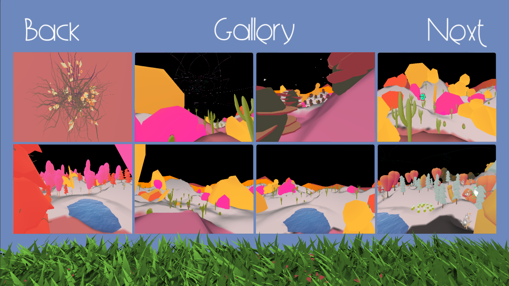
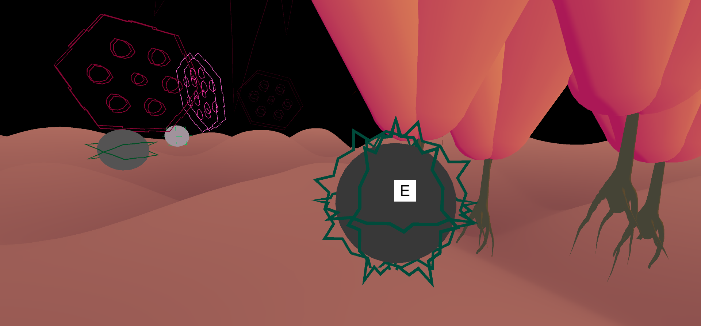

Mind's Garden is a first person musical exploration game which reads in audio files to procedurally generate various terrains, characters, and experiences for the player to explore and discover. Every audio file produces a unique playthrough.

---
## Week 9
March 10 - 17
### Magic sparks, adjustments and bug fixes
At this point in the project, we have everything in one branch or another- it's time to adjust settings (like our paint radius for painting the terrain) and fix bugs. That being said, we did add magic sparks in the sky this week, a new feature, that pulse with a song's beat.

Features now in our master branch include grass patches (finally), more menu settings and weather/fog coloring from last week. Bugs fixed include insets not flapping/spawning correctly, orbs spawning in trees, fixing some spleeter settings, and continuing to make the player not fall through the ground with the "bouncy" objects in the game. Improvements/adjustments include adding an extra cell layer to all objects in the color palettes, smoothing/shortening the radius of the terrain painting, implementing a working loading bar when the game starts up, screenshoting an event with multiple clicks, editing skyboxes, having the player exit the game on song end, improving the screenshot gallery order, adding biome options for the player when they choose a song, and adjusting skyboxes for all biomes to work with the fractals in the sky. 

### Massive Color Palette Expansion
When we first implemented the color palettes several weeks ago, we included colors for everything we could think of being in the game, including things like the bugs and fish, but we hadn't implemented the routines yet that would allow us to have control over these assets to change the colors on the beat. So one of the first things we did this past week was finish implementing every routine needed to control these objects, including the rest of the biomes, before this week we also only had one out of the four biomes "connected" to the ability to change color. In this process ce also figured out how to make the color changing process multiple orders of magnitude more efficient which was actually a project saver. We started needing so many objects to change thear color all at once every beat of the song, and it was slowing the game down to absolutely unplayable framerates. We almost needed to remove the color changing from the lame completely in order to finish it properly, but now with the improvements made and the spare computational resources we now have, the door is open for us to explore even more advanced color changing techniques like smooth color transitions instead of the abrupt transitions that currently happen.

After we made these changes we got to really see our color system doing its work in full force and it was amazing, but still left something to be desired. We came to the conclusion that if we added an extra cel shader color onto each of our materials, it'd greatly improve the visuals of our project in two ways. First it would add more depth and variation to each object, things were looking a little not interesting enough with only two colors per material. And second, having three colors we can apply per material gives us hundreds of different patterns we could chose from for swapping the colors through the material instead of the one single pattern of swapping back and forth that you can do with just two colors. Of course moving from two colors per material to three colors also means expanding every single color palette to pretty much 150% their original size, and they weren't small color palettes to begin with. Adding this many colors and making them look right is a lot of of work, so we haven't finished that yet, but we'll be able to show all that off as well as our fancy new three color patterns next week in our very final process log before completion.

### Grass!
The grass may have been able to defeat us weeks ago, but this week we strapped up our armor again to once more fight the dragon. And we were succsessful, we've slain the dragon and have patches of grass in the game! This took yet another complete rethink and rewrite of the algorithm that randomly generates grass. But this time with a fresh mindset and a completely new idea about how to structure things, we were able to get beautiful randomly generated patches of grass. There might be some small changes in the future to make the patches of grass more patchy and less like they snake around the map, but for now it's a huge inprovement to the look and feel of the game already.

### Loading Screens and UI Improvements
This week was focused on improving user feedback in various ways. Orbs now only light up once grabbed, and a subtle flash feature will later be incorporated as well. A simple loading bar was created, which can be passed an asyncronous process (such as loading between scenes) and visually convey its progress. A different loading icon is displayed for more drawn out tasks, like spleeter imports and loading the song library, and simultaneously serves to prevent players from clicking on menu buttons during this time.

In addition to these interface adjustments, the gallery is now programmed to sort files by automatically assigning today's date as the filename (3/3/2020 12:34 PM --> "30320201234PM.png"). While this works for now, the gallery will likely require additional subdirectories to divide up the months and years. These subdirectories would make it more organized in the file browser and also make it easier to load images chronologically.

### Non-Spleeter Mode
Knowing that most people won't want to download an external program to play a game, we've opted to include a number of songs already prepared with spleeter and the default option to import songs without it. The "[S]" symbol next to the songname indicates that is will be played with spleeter on. Otherwise, imported songs will have a different playmode in which each orb possesses the full song audio, but simply raises the volume slightly with each find. Currently this mode is still under development, but it will allow us to cater to a larger audience of people who do not have time to download spleeter.

---
## Week 8
March 3 - 10
### Bug fixes and weather
We've fixed problems with bug swarms moving below the terrain as well as with the look of the water material. The bonefish, unlike the other "enemy" objects, pushed the player below the map even with a push upwards. The push was modified to be almost completely vertical, but will need some aditional testing to make sure this works. We now have weather for cloud accumulation, rain, snow, and "sparkle" storms, but will need to decide what activates these conditions.  

### All Biomes Synced Up
All biomes are officially integrated and behave as instantiable spawners which are attached to each audio orb at start time. Each spawner prefab is simply an empty game object with scripts to spawn different variations of trees, rocks, grass, creatures, etc. Every plant within these biomes also responds to the music in some fashion, but the values and behaviors are still being optimized to facilitate the best visual-audio experience. Additional changes were made so that plants get automatically paired up with the nearest audio orb, so the environments look more closely linked to the orbs themselves.

### File Organization and Succesful Head Spawning
When your're creating something this big in scope in just 12 weeks time, you have to move super fast. Part of moving fast and working as a team means that the file structures and naming schemes become inconsistent and messy. This is something that we were able to deal with for quite a long time, and so we prioritized getting new feaures added before properly organizing the old features. But eventually the disorganization caught up with us and started slowing our work down way too much. So we took some time this week to reorganize our files. We didn't get it 100% completely organized, but we certainly got it cleaned up enough to make our final couple of weeks working on this project go smoothly. We also put the finishing touches on the head instancing done the week before, and now we have fully spawnable heads that we can then create mathematical variations based on the input song.

### Updates to the color system
This week we also finished up adding all 6 of the color palettes designed earlier to the game. After adding the color palletes to the game, we also had to recode how our universal color controller worked because there's been several changes made on how the biomes themselves work overall. So far, only the desert biome works but one of the many goals for next week is to add the ability to control the other three biomes from our color system.

---
## Week 7
February 25 - March 3
### Menu Libraries for Songs and Screenshots
The main menu now comes equipped with a build in song library that loads in songs from both the Assets/Resources folder and the persistent data path (in which all the imported songs are stored). Using the Assets/Resources folder means we can include a list of prepared songs for the user to experience without having to import any songs of their own, and in addition they will be able to play the game using the Spleeter mode even if they don't have it installed on their computer. All other imported songs are put at the top of the list above the included songs. The screenshot gallery has also been implemented, which loads in all the screenshots that have been saved to the persistent data path. The gallery itself also scales to the amount of screenshots there are, extending the number of panels or deleting them according to how many pictures exist in the directory.

### Simple Pause Menu
The game can now be paused by hitting Escape (Return in the Unity editor). This frees the cursor from the first person controller and sets the timescale to zero so the player can adjust options such as volume and tutorials. The pause menu also allows the player to return to the main menu by hitting exit.

### Bouncy Enemies
We now have enemies of a sort for the desert, underwater and jungle biome. Newly modeled ones include a bone fish for underwater and a carnivorous plant for the jungle. They push the player back and emit colored particles when in contact with the player. 

### Grass Spawning Disasters
Continuing our work from last week on these subjects, we tried finishing the grass spawning algorithm. Despite the algorithm seeming almost finished for a week now, we've been fighting a stupid bug preventing it from all coming together this entire time. This bug has even prompted a complete rewrite of the algorithm that still resulted in the same unknown problem. At this time this issue has sucked up too much time,and we have to move it to the backburner until we finish more important things such as head instatcing and finishing implementing the rest of the color palettes.

### Head Instancing and Color Palettes
This week we worked on finishing the work done last week on removing static script references to objects we want to be instatiable, like the heads. We've removed all static script references that we need to throughout the entire project, and replaced them with direct object references. But since the bugs with the grass stole so much time, we haven't gotten around to setting up/connecting every single direct object reference yet. We also intended to have the remaining color palettes imvorted into the game by this week, but for the same time related reasons that has been pushed back to next week as well. In the meantime, we've identified 9 more colors that we've added to each palette.

---
## Week 6
February 18 - 25
### Improved Biome Spawning/Swapping
With the addition of the underwater biome, modifications to the main spawner were made to allow for biome swapping. At every song segment, all the prefabs of the previous biome are replaced with a new biome's prefab set. The inhabiting creatures also get swapped out, with flocking bugs for the forest region and floating fish for the water. More work needs to be done to ensure that all the materials in the new biome get factored into the color swapping algorithm, otherwise the newly spawned prefabs don't change color or simply crash the program.

### Head Instancing and Grass Spawning
Earlier this month we decided on a look for our grass that we really liked, so now we felt it was time we started incorporating it into the game in a meaningful way. We started creating a new procedural generation algorithm to place patches of grass around the terrain similar to the algorithms used to generate the terrain and the pond shapes. This algorithm is almost complete now, but it is still lacking more sophisticated helper methods compared to its terrain algorithm counterpart to be fully functional, so unfortunately screenshots of the grass patches will have to wait till next week.

Prior to now we had been developing everything as separate systems all together in a single scene, but ultimately we want to be able to spawn multiple instances of the heads with all of its contents together inside of it. So this week we worked towards that goal by moving everything into an instantiable prefab object, and refactoring the code to no longer use static script references where we need to. More of said refactoring needs to come in the following week, but pretty soon the head should be instantiated and the game started all just from the click of a menu button.

### The Rest of the Biomes
Two biomes wouldn't be nearly as fun as four biomes, so we created assets for the other two biomes this week- desert and jungle. The jungle is short one plant compared to other biomes, since the third plant will be part of a new type of feature to be discussed. We also fixed some problems with asset spawning in general and made the interaction between spawning assets and their "to music" animations more fluid and easier to work with. 

---
## Week 5
February 11 - 18
### Enhanced Randomization
To add more variability to the world, we began playing around with randomized values for certain things like the shape of the skyfractal and terrain. This involved some trial and error to narrow down what range of values should be used for any given parameter; without these constraints the objects were liable to become too "chaotic" with the randomized parameters. Randomization ensures that every time players enter the game, they'll be presented with a brand new experience built around the song they selected.

### Improved Spawning and Brought in Creatures
One tricky aspect of procedurally spawning in prefabs is making sure that nothing overlaps and everything ends up where it's supposed to. This means no trees sticking out of rocks or spawning outside the bounds of the head. We worked on improving this spawning algorithm to ensure this doesn't happen. The same goes for the creatures, but depending on the creatures behavior (flocking, flying, or stationary) other methods must be used to guarantee that they don't phase through rocks or the terrain itself.

### Underwater Biome
We also got a great start on our second biome- underwater. With three animated plants (both to-music animations and spawn animations), we should be ready to start and finish our other two biomes. 

### Color Palettes
Along with switching assets to give the feeling of a different biome, another way we're trying to make each play through vastly different from another is by using color palettes that are consistent within each song, but switch palettes from one song to another. With so many asseets and so many colors to change, each palette contains more than 75 colors each, and they're still growing as the game develops further. We had to create a large system to label what each color should be for (bug body, grass, rock 1-5, etc.) and actually connect those colors to those objects in the game. With the new color system, the colors of the objects now respond to the song just like their movements.

---
## Mentor Feedback
February 11

[Write-up of Ben Wander's feedback](MentorFeedback-BenWander.md)

[Write-up of Ian Hales's feedback](MentorFeedback-IanHales.md)

---
## Week 4
February 4 - 11
### Creatures and Flocking
Fish were finished and animated this week, and three kinds of bugs were animated and used as boids. These creatures are ready to be affected by a sound/music multiplier and by color-changing scripts. They require an area or target to swarm around (we made one for each flock system that randomly changes location every ~0.5 seconds). This can also be moved by music to path the flocks.

### Rhythm Analysis Integration
Up until now we've used one script for analyzing audio behavior in our game with help from the built in FFT function to get sample data. This AudioPeer class works very well for obtaining values moment to moment and getting things to react on demand, however, it lacks the analytical capacity to assess other song aspects such as tempo and segment changes. Segments, for the record, are distinct song regions such as verse, chorus, or bridge, and are often detected by sudden shifts in overall song volume. The Rhythm Tool analyzer from the Unity Asset Store helps to facilitate all this information and more. It comes with a robust, built in event system to detect the beat and onset of the actual notes being played, providing important information about the audio that couldn't be obtained with the AudioPeer script alone. Currently this tool is implemented to listen to the whole song (which is set to silent via its output on the audio mixer) as opposed to the individual song tracks; this gives a better estimation of the true tempo, onset, and song segments.

### Main Menu and File Importing
To get a more complete test build to our mentors and peers, we touched up the main menu's overall design and functionality. Obtaining file paths using Unity is easier said than done sometimes, but with help from a file explorer GUI plugin this process got simplified dramatically. Now users can pick a song from their computers via the main menu, which gets imported as an mp3 or wav file to be used in the game. As it currently stands, the Spleeter process for separating out the song's tracks is still limited to those who have Spleeter already installed and working on their Windows system. This is a step in the right direction, at least, since now the main menu is capable of passing information such as songs and sound options to the main scene.

### Terrain Painting
This week to add some more interactivity into the game we added a terrain painting feature. This involves changing the terrain's texture to add color underneath the player. We are still brainstorming how the color will interact and change, but currently it is just rotating between red green and blue. A gif showing how the terrain actually gets painted is featured below.

---
## Week 3
January 28 - February 4
### Even more assets
We made some of our last essential assets this week, which included writing a geometry shader for manipulating and constructing stylized grass, animating all trees on spawn, writing a color-changing script that takes shader aspects (including multiple color variables) and lerps them over time specified by the song, and modeling our first creature- a fish in the pond. The grass shader draws a series of bent triangles on specified verticies of a mesh, while randomly rotating the topmost triangles (to avoid the bottom of a blade of grass rotating). It also pushes a 2-channel noise map over the triangles to create the illusion of wind. Trees are animated in a cartoon-like fashion, with branches and the sort quickly popping out from the trunk of most trees. The color-changing script sets the starting and finishing color of the main color and shadow color and moves back and forth between the two colors, while also changing how float values for the shadow's fade and spread into the main color. This script will later be modified so that the color and shadow color start/end colors will be determined by a random color value within a range and color palette decided by the song, but we still need to discuss corresponding song values and palettes. The fish is in the low-poly style of our world, with a large dorsal and tail piece. It will be a good discussion piece for our meeting on Tuesday to finalize direction with the creature looks. 

### Orb Particles and Behaviors
The audio orbs now have a particle system which indicated the orb has be activated. Once activated the orb will follow the player using the Vector3.MoveTowards() function while being nudged by random force vectors to make each orb more floaty as opposed to following the player in a straight line. Once the orb nears the central pond, however, it stops following the player and hovers around the pond. Returning an orb to the pond sets the audio source's parent as the player so that the audio plays at a constant volume wherever they go.

### Prefab Spawning
Trees and rocks can now be randomly generated around each orb given a certain radius. When instantiated, both trees and rocks use the GetTerrainHeight() function to determine the appropriate Y position and offset to make the prefabs level with the rest of the terrain. Trees, however, also get assigned that orb's audio peer to respond to the music being played. More work needs to be done to effectively generate a natural and appealing landscape, and eventually we'll want each orb to have its own biome, but this is a good introduction to prefab spawning and grouping.

### World Assembly
Now that we can succesfully generate terrain to our liking, this week it was time to start assembling everything together. We filled the pond with water, and then placed the terrain inside of the head. To create bounds to the play area, we raised the edges of the head up to the same level as the terrain (plus some). This helped really pull the scene together to look like one cohesive unit. The picture below is of the whole unit of head and terrian tied together.

### Project Branding
This week we created the first iteration of the logo for this project, it's featured at the top of this page as well as the main page of the repo. The project branding will continue to evolve and expand as development continues, but for now we have a really good start.

---
## Week 2
January 21 - 28
### More terrain
After getting a solid start on procedural terrain generation last week, we just needed to make a few smaller improvements to the algorithm, and also throw in some specifics things that apply to our project. The first general improvement was to give a consistent height to all of the different randomly generated maps. This was done by loweringthe height of the map, until the point (x,z) = (0,0) has height y = 0. The next improvement was to partially flatten all of the terrain that is below height y = 0 (below the spawn point). This really brought out the mountains in the terrain and made it feel much more real and interesting. Finally we wanted to tailor the terrain more specifically to our needs, first we flattened out the area around the spawn to make room for a pond in the center of the map, and then we lowered the terrain in the middle of the flattened area to create an indent for the pond. The outline of the pond is randomly generated with a Perlin noise technique, so the pod changes shape with each seed as well. The picture at the end of this section shows the terrain after these changes were made, and the animation shows the randomly generated ponds shapes.

### Asset integration
#### 3D Assets
We built the second round of Prefabs/game world objects this week, which included the head model, cobblestone pond walls, and rock formations. The head needed to be chopped right above the brow, with a flat head top and wall around the top. This will be useful for our UI and game pictures, as one of the core ideas of the game is this mass garden within a mind (and therefore within a head). The walls will be for keeping the player on the right part of the pond, so the orb can be inserted into the right place. The rocks are a more static element against the changing sky, trees and music. We have also decided to use Staggart Creation's grass shaders, with some of our own grass textures drawn in Photoshop, as they provide a style that fits our game, as well as many customizable features, such as wind and color scattering.
#### Audio visualizer
This week we began playing with different variations for audio visualized assets to build up an assortment of prefabs to spawn into the world. I expanded upon the fractal generator script to allow for randommization and streamlined customizability, meaning any number of unique fractal variations can be created with ease. While making modifications to audio-visualized objects and components, I also made some simple orb designs. Following the sound of these orbs will be the primary objective in our game loop, with each of them playing a different instrument from the desired song. Their behavior is very simple for now, with basic toggle control and UI components to activate/deactivate the volume, but they will eventually be able to emmit particles, follow players around, spawn in at random locations, and act as key game objects within the Mind Garden.

### Main menu
This week we started considering the main menu of the game. We have prototyped the drag and drop functionality for adding songs to the game from externally in the computer, and we've also discussed and sketched our intentions for menu flow and design. There is more agreement than disagreement in the group on this, but there are still too many good and conflicting ideas, so the actual menu design will be revisited in a later week as it's not as high of a priority right now.

---
## Week 1
January 14 - 21
### Implementing Spleeter in Unity
Spleeter is a free audio separation tool by [Deezer](https://github.com/deezer/spleeter) which uses tensor-flow and machine learning to take out the vocals, drums, and bass within an audio source and save them as .wav files. Any audio input can be separated into multiple audio tracks, which allows us to play different aspect of a song in different locations across the scene. However, because Spleeter is written in Python as oppossed to C#, there are limitations implementing it within the Unity engine. As it is now, Unity is able to execuate a command line argument from a script and link the output files to the scene's audio sources. This works fine, but it is dependent on already having spleeter installed and working on that computer to actually run the executable. In the future, we will explore how to package spleeter and its libraries more efficiently within the Unity engine. Furthermore, the trained data models used to separate the audio are quite large (upwards of 150MB). GitHub is unable to store files over 100MB, so because of this an external Git extension called [Large File Storage](https://git-lfs.github.com/) (LFS) is required to access these data models from the repository. Essentially, LFS uses text pointers to access the files, which are stored remotely on GitHub.com or GitHub Enterprise.

### Trees, water, and splashes
We have three different types of trees to generate that all take a single variable (which will later be taken from the song itself) and move, rotate, scale, or otherwise change in a way that changes by this single variable being multiplied to pieces of the trees. We also have an edited water shader working and moving as our game's central "sound pond." Multiple particle systems show a splash for dropping any and all sound orbs into the pond. These assets are ready for import into the main project.

### Procedural terrain generation
The terrain generation started off with a couple of false starts: square lattices and spiral initialization patterns, but soon enough we realized that was the wrong rabbit hole to go down, and backed out to approach it in a better way. We decided to move to a skewable triangular lattice rather than the square lattice to make the terrain look smoother at lower resolutions. And the intention behind the spiral pattern was to be able to combine vertex and triangle initialization into the same loop as well as allow the domain to have shaped boundaries of potentially unknown shapes. This ended up being solved in an easier way by the triangular lattice itself as well as the use of adjustable length lists rather than fixed length arrays. The picture at the end of this section shows the progression of the terrain mesh, and the leftmost frame shows the terrain at this stage: the mesh had been created successfully in a triangular lattice pattern, but the boundary was still normal and rectangular. The next step was to create shapes out of the boundary of the mesh, so we inserted an elipse boundary based off the previous rectangle. After fixing the many bugs that now had an opportunity to present themselves, the middle frame of the picture below shows the state at this point. The final step was to add the actually height of the terrain so it wasn't just a flat circle on the ground. We watched [Sebastian Lague's tutorial on procedural terrain generation](https://www.youtube.com/playlist?list=PLFt_AvWsXl0eBW2EiBtl_sxmDtSgZBxB3) to learn about how Perlin noise is used in context of terrain (octaves, persistence, lacunarity, etc.) but didn't actually follow the tutorial directly because our project is very different from his, and there were better ways to incorporate the concepts from the videos into our project. After incorporating the Perlin noise terrain generation into the project, the overall "procedurally generated terrain" aspect was pretty much done. We tweaked some parameters to get some good looking terrain for the third and final frame of the picture down below, but there will be much more tweaking to come in the future when there are more features to relate the terrain to.

---
