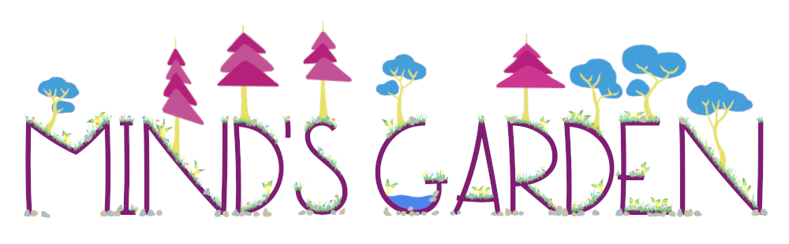

A combination of music adventure game and audio visualizer. Developed as a Capstone Project for the Technology Arts and Media (TAM) major at CU Boulder by [Peter Rosenthal](https://github.com/cyuun), [Jared Myers](https://github.com/jamy3873), and [Kara Metcalfe](http://github.com/kmetcalfe1).

View the [Process Log](Process/) to find out more about the game as it is created.